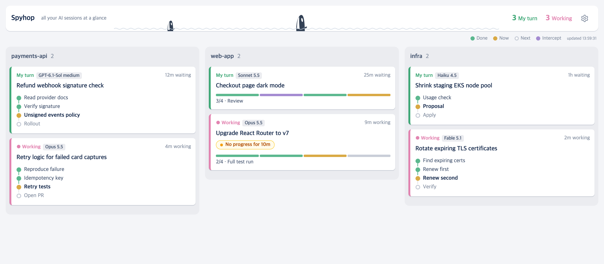
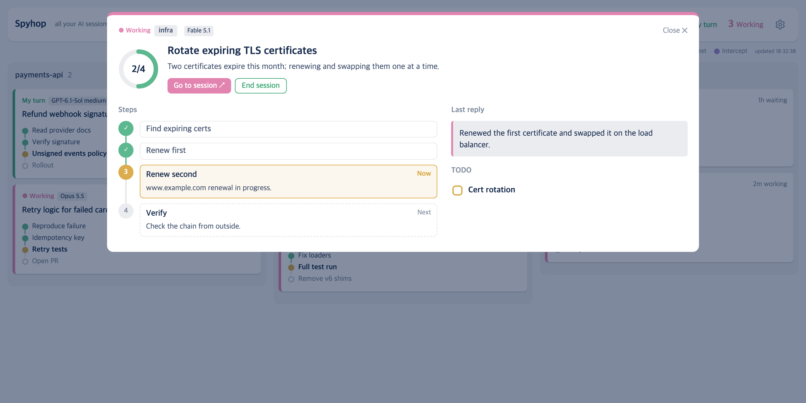
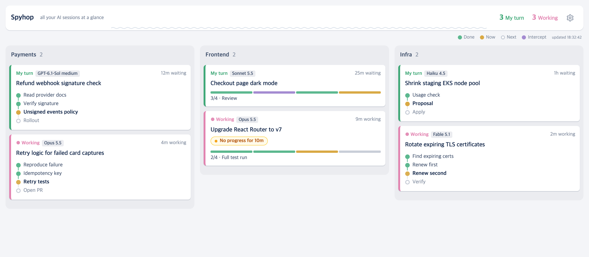
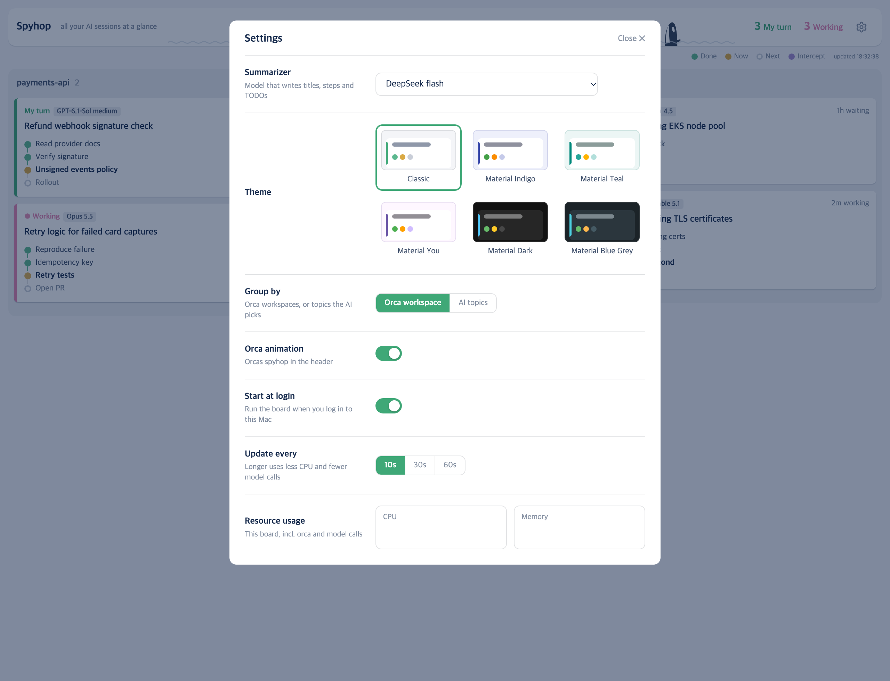
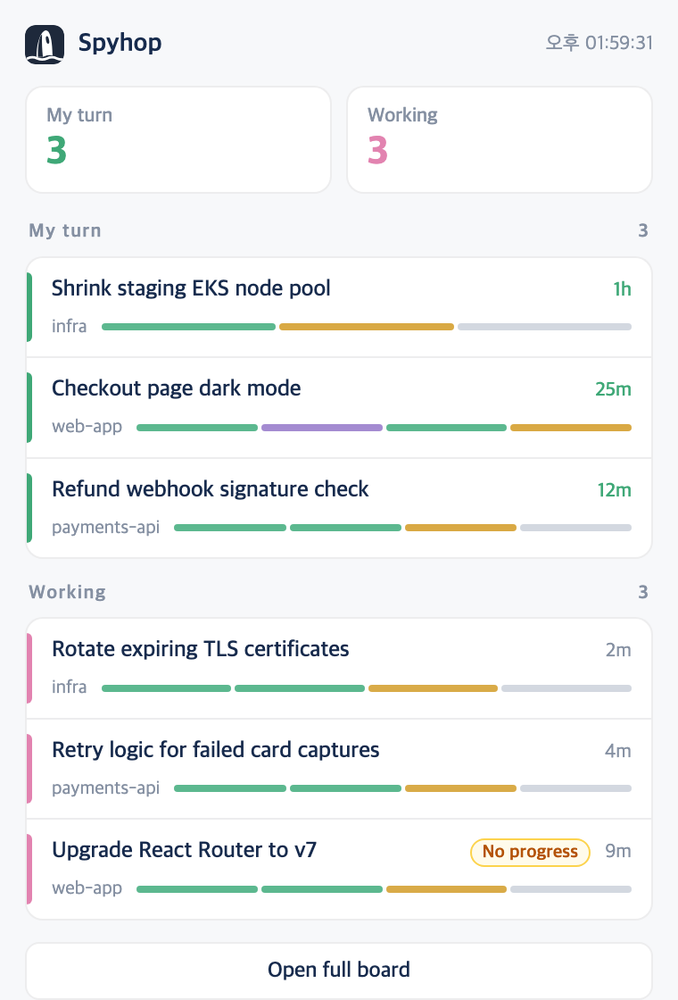

<p align="center">
  
</p>

<h1 align="center">Spyhop</h1>

<p align="center">
  <b>Every AI coding session you have running, on one board.</b><br>
  <sub>What each Claude Code and Codex session is doing, how far it has come, and whether it is waiting for you.</sub>
</p>

<p align="center">
  
  
  
  
  
</p>

<p align="center"><i>Spyhop: when an orca pokes its head straight out of the water to look around.</i></p>



## Why

You run several Claude Code and Codex sessions at once and lose track of which one finished, which one is waiting for you, and which one has been stuck for ten minutes.
Spyhop turns every session into a card with its steps, its TODOs and whose turn it is, summarized from the transcript.

## Quick start

```bash
brew install leeleelee3264/tap/spyhop
spyhop
```

Or without Homebrew: `git clone https://github.com/leeleelee3264/spyhop.git && cd spyhop && ./spyhop`.

- You need [Orca](https://github.com/stablyai/orca) and the `claude` CLI logged in. Nothing else: no `pip install`.
- **Without Orca the board stays empty** — Spyhop finds sessions through Orca today.
- The board opens in Orca, in a **Spyhop** workspace under a small `~/.spyhop` project that Spyhop creates for itself (your own repositories are never touched). It is also at `http://127.0.0.1:47613/`.

## AI summarizer

Spyhop reads each session's transcript and asks an AI model to write the card: title, steps and TODOs.
You can use whichever of these you already have. Pick one in **Settings → Summarizer**; only the ones available on your Mac are listed.

| Summarizer | Models | What you need | Where transcripts go |
|---|---|---|---|
| Claude (claude CLI) | Haiku, Sonnet, Opus, Fable | `claude` installed and logged in | Anthropic |
| Codex (codex CLI) | Models in your Codex model list | `codex` installed and logged in | OpenAI |
| DeepSeek (API) | DeepSeek flash | An API key in the macOS keychain (below) | DeepSeek |

- Out of the box Spyhop uses the first one it finds. If you only have the `claude` CLI, that is what it uses — the DeepSeek key is optional.
- Claude and Codex run through your existing login and subscription. Spyhop runs them with tools disabled and without saving the summary call as a new conversation.
- DeepSeek is the fastest (about 6 s per session). To use it, store your key once:

```bash
security add-generic-password -s deepseek-api -a "$USER" -w '<your API key>'
```

Before anything is sent, strings that look like keys, tokens and passwords are masked. It is a best-effort filter — pick a model your organization allows.

## Features

### Board

Each Orca workspace is a column and each session is a card.

- **Steps** read top to bottom: `Done` · `Now` · `Next`, plus purple **Intercept** for a quick side task handled in the middle of the main one.
- **My turn / Working** counts sit in the header, and sessions waiting for you are at the top of each column.
- A **No progress** badge appears when a working session hasn't written anything for 5 minutes — a long test run, or a stuck tool.
- When the window is short, the cards in a column shrink together into progress bars.
- Helper panes that a session starts through Orca orchestration (a cross-check, a second review) don't get their own card. They show up as one line under the session that started them, e.g. `↳ Codex · Done`, and the detail view shows their one-line result.

### Detail view

Click a card to see every step with a one-line explanation, the last reply, a TODO checklist you can tick yourself, the raw last request and reply, and the session ID (click to copy `claude --resume <id>` / `codex resume <id>`). From here you can jump to the session or end it.



### Group by AI topics

Instead of Orca workspaces, let the AI sort sessions into up to six topics. Groups stay once assigned, and dragging a card onto another group pins it there. While new sessions are being sorted, a small spinner shows "Grouping N sessions by topic…".



### Settings

Click the gear icon in the header.

| Setting | What it does |
|---|---|
| Summarizer | The AI model that writes the cards (see above). |
| Theme | Light: Classic (follows macOS dark mode), GitHub Light, Catppuccin Latte, Solarized Light, Rosé Pine Dawn. Dark: GitHub Dark, Catppuccin Mocha, Tokyo Night, Dracula, Nord. |
| Group by | Orca workspace or AI topics. |
| Orca animation | Little orcas spyhop out of the wave in the header. |
| Start at login | Starts the board when you log in to the Mac. Off by default. |
| Update every | 10 / 30 / 60 seconds. Longer means less CPU and fewer model calls. |
| Resource usage | Live CPU and memory of the board itself. |



### Menu bar (optional)

An orca icon in the menu bar shows how many sessions are waiting for you. Click it for a compact list — sessions waiting for you first — and click a row to jump to that session.



To add it, install [SwiftBar](https://github.com/swiftbar/SwiftBar) and link the plugin into SwiftBar's plugin folder:

```bash
ln -s "$(brew --prefix)/opt/spyhop/libexec/menubar/spyhop.5s.py" "<SwiftBar plugin folder>/spyhop.5s.py"   # or $PWD/menubar/... from a clone
```

The plugin also starts the board whenever Claude or Codex is running.

## Uninstall

Turn off **Start at login** in Settings, run `brew uninstall spyhop` (or delete the repo folder), delete `~/.spyhop`, remove the **.spyhop** project from Orca's sidebar, and remove the SwiftBar link if you added one.
The board stops by itself within 30 minutes once no sessions are open.

## More

How it works, when it runs, privacy and file locations: [docs/details.md](docs/details.md).

## TODO

- [ ] **Work without Orca** — find sessions from recent Claude/Codex transcripts and group them by AI topics.
- [ ] Many groups: minimum column width with sideways scroll; a "reset groups" button.
- [ ] Try "move to another workspace" end to end with real sessions.
- [ ] Keep one source of truth for the code.
- [ ] Add a license.
- [ ] Notify when a session turns to "My turn".
- [ ] Show PR status on cards.
- [ ] Setting for the language of card content.
